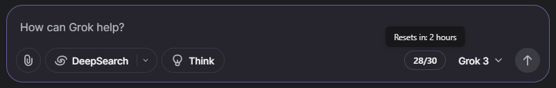

# Grok Rate Limit UI

A simple Chrome extension that displays your Grok rate limits directly in the Grok web interface.

## Description

This Chrome extension enhances your Grok experience by providing real-time visibility into your rate limits. Instead of wondering how many requests you have left, the extension adds a small counter directly in the Grok interface that displays your remaining requests out of your total allocation.

The counter updates automatically whenever you send a message to Grok, as that's when the site fetches rate limit information from the API.

## Features

- 📊 Displays remaining/total API requests
- 🎨 Color-coded indicator (green → yellow → red) based on usage
- 🔄 Automatically updates after each message
- ⚡ Lightweight with minimal performance impact
- 🛡️ Requires no additional permissions beyond accessing Grok

## Installation

<!-- ### From Chrome Web Store (Recommended)

1. Visit the [Chrome Web Store page](https://chrome.google.com/webstore/)
2. Click "Add to Chrome"
3. Confirm the installation -->

### Manual Installation

#### From Source for Chrome

1. Clone this repository or download the source code
2. Open Chrome and navigate to `chrome://extensions`
3. Enable "Developer mode" in the top-right corner
4. Click "Load unpacked" and select the `src` folder from this repository
5. The extension is now installed and active when you visit grok.com

#### From Source for Safari

1. Clone this repository or download the source code
2. Open Safari settings and select the Advanced tab. Enable `Show features for web developers`
3. In the Developer tab, enable `Allow unsigned extensions`
4. Open `Grok Limit UI Safari/Grok Limit UI.xcodeproj` in xCode
5. Build and Run the application
6. A window will open up saying the extension is not enabled in Safari. Click `Quit and Open Safari Settings`
7. Enable the extension in the Safari Extensions tab

## Usage

1. Visit [grok.com](https://grok.com)
2. You'll see a small counter on the bottom right of the input area showing your remaining requests
3. The counter updates each time you send a message
4. Color changes indicate your remaining capacity:
   - White/Green: Plenty of requests left
   - Orange: Under 30% remaining
   - Red: Under 10% remaining

## Roadmap

Potential future enhancements:

- Chrome Web Store release if it gains traction
- Proactive updates when switching models or using different features
- Automatic refresh of rate limit data
- Customizable notification thresholds

## Development

This extension consists of:

- `contentScript.js`: Injects display element and handles DOM interactions
- `networkMonitor.js`: Monitors network requests to capture rate limit data
- `rateLimitDisplay.html`: Contains the UI element and styling

To contribute:

1. Fork this repository
2. Make your changes
3. Test locally using the manual installation steps
4. Submit a pull request

## License

MIT License - See [LICENSE](LICENSE) file for details

## Author

Created by [Connor](https://connorlin.dev/) - A Grok enthusiast who got tired of hitting rate limits unexpectedly.

If you find this extension useful, consider starring the repository!

<!-- If you find this extension useful, consider [buying me a coffee](https://www.buymeacoffee.com/) or starring the repository! -->
